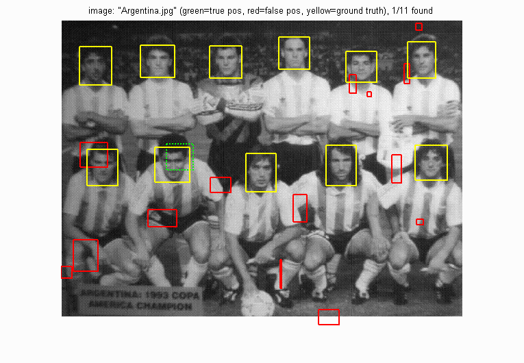

# Your Name <span style="color:red">(id)</span>

#Project 4 / Face Detection with a Sliding Window

## Overview
The project is related to 
> quote


## Implementation
1. One
	* item
	* item
2. Two

```
Code highlights
```

## Installation
* Other required packages.
* How to compile from source?

### Results

<table border=1>
<tr>
<td>


</td>
</tr>

<tr>
<td>


</td>
</tr>

</table>


<center>
<p>
Face template HoG visualization for the starter code. This is completely random, but it should actually look like a face once you train a reasonable classifier.
<p>

<p>
Precision Recall curve for the starter code.
<p>

<p>
Example of detection on the test set from the starter code.


</center>
