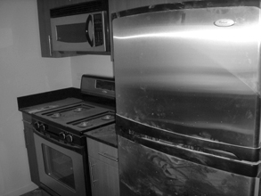
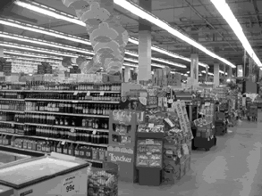
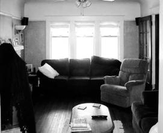
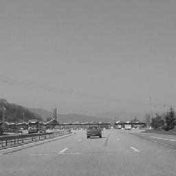
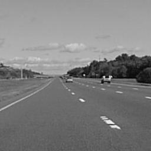

# 陳麒皓 <span style="color:red">(student ID : 106061516)</span>

# Project 3 / Scene recognition with bag of words

## Overview
The goal of this project is to do image classification.To examine this task of scene recognition starting with very simple methods -- tiny images and nearest neighbor classification -- and then move on to techniques that resemble the state-of-the-art -- bags of quantized local features and linear classifiers learned by support vector machines.

## Implementation  
### 1.Feature Extracting
####  (1) Tiny image representation(get_tiny_images.py)  
The "tiny image" feature is one of the simplest possible image representations. To build a tiny image feature, simply resize the original image to a very small square resolution, e.g. 16x16, and make the tiny images zero mean and unit length (normalizing them).
```
    width = height = 16
    
    tiny_images = np.zeros((len(image_paths), width * height), dtype = 'float32')
    
    for num in range(len(image_paths)):
        img = Image.open(image_paths[num])
        img_resize = np.asarray(img.resize((width, height), Image.ANTIALIAS), dtype='float32')
        img_resize = img_resize.flatten()
        img_tiny = (img_resize-np.mean(img_resize))/np.std(img_resize)
        tiny_images[num, :] = img_tiny
```  
####  (2) Bag of SIFT representation(build_vocabulary.py and get_bags_of_sifts.py)  
#### (i)Step 1(build_vocabulary.py):  
Before representing training and testing images as bag of feature histograms, we first need to establish a vocabulary of visual words. We will form this vocabulary by sampling many local features from our training set and then clustering them with kmeans. The number of kmeans clusters is the size of our vocabulary and the size of our features. For any new SIFT feature we observe, we can figure out which region it belongs to as long as we save the centroids of our original clusters. Those centroids are our visual word vocabulary.  
Gets three vocabularies files (.pkl) after building vocabularies from training and testing images by K-means method.  
```
    bag_of_features = []
    for path in image_paths:
       img = np.asarray(Image.open(path),dtype = 'float32')
       frames, descriptors = dsift(img, step = [5,5], fast = True)
       bag_of_features.append(descriptors)
    bag_of_features = np.concatenate(bag_of_features, axis = 0).astype('float32')
    vocab = kmeans(bag_of_features, vocab_size, initialization = "PLUSPLUS")   
```
#### (ii)Step 2(get_bags_of_sifts.py):  
After getting the SIFT feature and classifying each feature into nearest cluster centers, calculating amount of feature in each cluster.
```
    f = open('vocab.pkl', 'rb')
    voc = pickle.load(f)
    voc_size = len(voc)
    len_img = len(image_paths)
    image_feats = np.zeros((len_img, voc_size))
    
    for idx, path in enumerate(image_paths):
        img = np.asarray(Image.open(path),dtype = 'float32')
        frames, descriptors = dsift(img, step=[5,5], fast=True)
        d = distance.cdist(voc, descriptors, 'euclidean')
        dist = np.argmin(d, axis = 0)
        histo, bins = np.histogram(dist, range(voc_size+1))
        norm = np.linalg.norm(histo)
        if norm == 0:
            image_feats[idx, :] = histo
        else:
            image_feats[idx, :] = histo/norm
```
### 2. Classifier  
#### (1)Nearest Neighbor Classifier(nearest_neighbor_classify.py)  
Calculates the distance between each testing images and all training images, then chooses the minimum distance for each testing images to decide which class it belonging.
```
    test_predicts = []
    for num in range(test_image_feats.shape[0]):
        each_row = []
        each = np.tile(test_image_feats[num],(train_image_feats.shape[0],1))
        square_each = np.square(each - train_image_feats)
        for sq in range(square_each.shape[0]):
            each_row.append(np.sqrt(sum(square_each[sq])))
        minimum = min(each_row)
        minimum_ind = each_row.index(min(each_row))
        test_predicts.append(train_labels[minimum_ind])
```
#### (2)SVM classification: (svm_classify.py)
Using "sklearn" to do linear SVM.
```
    clf = LinearSVC()
    clf.fit(train_image_feats, train_labels)
    pred_label = clf.predict(test_image_feats)
```

## Installation
* Other required packages  
	Install ```conda install -c menpo cyvlfeat```  
    
* How to run the code&emsp;---&emsp;python proj3.py --Feature --Classifier

### Results Overview  
* Do nothing, just run with random guessing: Accuracy = 6.3%  


* Tiny Image + Nearest Neighbor Classifier: Accuracy = 22.7%  
  

* Bag of SIFT Representation + Nearest Neighbor Classifier: Accuracy = 55%  
  

* Bag of SIFT Representation + Linear SVM Classifier: Accuracy = 71.9%  
  

### Extra results  
* Bag of SIFT Representation + non-Linear SVM Classifier(RBF kernel): Accuracy = 74.1%  
```
    clf = SVC(kernel = 'rbf', random_state=0, gamma = 0.2, C=10)
    clf.fit(train_image_feats, train_labels)
    pred_label = clf.predict(test_image_feats)
```
  

* Experiment with many different vocabulary sizes(Bag of SIFT Representation + Linear SVM Classifier):  

10: Accuracy = 46.1%  
20: Accuracy = 57.6%  
50: Accuracy = 64.5%  
100: Accuracy = 67.3%  
200: Accuracy = 65.9%  
400: Accuracy = 64.1%  
1000: Accuracy = 61.7%

* Cross Validation
```
    sc = cross_val_score(clf, train_image_feats, train_labels)
    print 'Validation Score:',sc.mean()
```


## Visualization
| Category name | Accuracy | Sample training images | Sample true positives | False positives with true label | False negatives with wrong predicted label |
| :-----------: | :------: | :--------------------: | :-------------------: | :-----------------------------: | :----------------------------------------: |
| Kitchen | 0.64 |  |  |  |  |
| Store | 0.64 |  |  |  |  |
| Bedroom | 0.59 |  |  |  |  |
| LivingRoom | 0.55 |  |  |  |  |
| Office | 0.86 |  |  |  |  |
| Industrial | 0.52 |  |  |  |  |
| Suburb | 0.95 |  |  |  |  |
| InsideCity | 0.73 |  |  |  |  |
| TallBuilding | 0.72 |  |  |  |  |
| Street | 0.79 |  |  |  |  |
| Highway | 0.78 |  |  |  |  |
| OpenCountry | 0.75 |  |  |  |  |
| Coast | 0.83 |  |  |  |  |
| Mountain | 0.82 |  |  |  |  |
| Forest | 0.94 |  |  |  |  |
